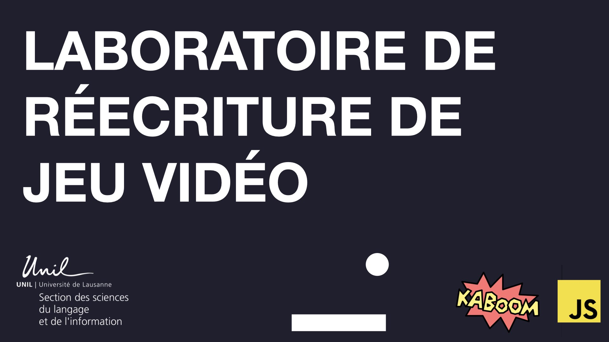

Ces codes sont fournis par Isaac Pante dans le cadre de l'édition 2021 du [laboratoire de réécriture de jeu vidéo.](https://www.epfl.ch/schools/cdh/fr/lart-et-la-culture/thema-2021-lincertitude/incertitude-et-jeu-video/) Il est organisé par la Section des sciences du langage de l'information de l'UNIL, le Gamelab UNIL-EPFL, le CDH et bénéficie du soutien de GAMEStar.

Pour lancer cet atelier, nous vous recommandons d'installer [Visual Studio Code](https://code.visualstudio.com/). Un breakout "initial" en Kaboom.js vous attend dans cette archive. COmmencez par analyser celui-ci pour bien comprendre la mécanique de jeu.

Un breakout "plus-complet", enrichi de plusieurs niveaux, de conditions de victoire et d'un mode debug vous attend dans cette même archive.

A vous de jouer !